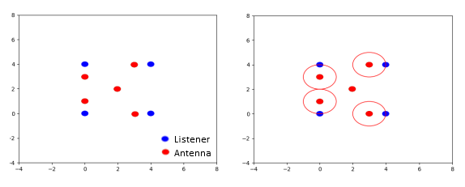
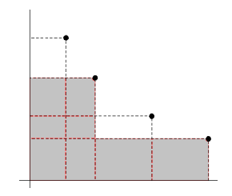
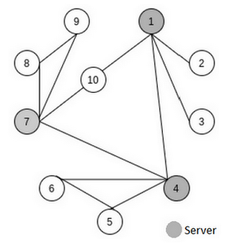

# competitive-programming-exercises

Programming exercises exploring algorithmic paradigms such as Recursion, Backtracking and Dynamic Programming and domains and application cases regarding Optimization and Graphs.

## Table of Contents
- [Prerequisites](#prerequisites)
- [Build and Run](#build-and-run)
- [Overview](#overview)
    - [Problem 1](#problem-1)
    - [Problem 2](#problem-2)
    - [Problem 3](#problem-3)
- [Contact](#contact)

## Prerequisites

- `G++` compiler

On Windows:
- Click [Mingw-w64](https://sourceforge.net/projects/mingw-w64/files/Toolchains%20targetting%20Win32/Personal%20Builds/mingw-builds/installer/mingw-w64-install.exe/download) to download the Windows Mingw-w64 installer. 
- Add the path to your Mingw-w64 bin folder to the Windows PATH environment variable.

On Debian or Ubuntu:

```bash
$ sudo apt update
$ sudo apt install build-essential
```

## Build and Run

The inputs_test folder of each Problem contains files that can be used as input to the programs. 

A `compile.bat` is provided to compile and run each problem. The input test used can be changed on that file.

To compile and run a problem on the terminal: 

```bash
$ compile
```

## Overview

### Problem 1

Given a set of antennas with different coverage radius and costs, we need to decide which antennas to place at which locations in order to provide full coverage to all the listeners, spending the least money as possible.



**Input**

Each input file contains only one test case. A test case starts with the number of listeners (1 ≤ p ≤ 200). Each of the following p lines contains two integers, the x and y coordinates of the location of a listener, in Km (0 ≤ x ≤ 99 and 0 ≤ y ≤ 99).

Then, a line with the number of possible places to install antennas (1 ≤ n ≤ 100). Each of the following n lines contains two integers, representing the x and y coordinates of a possible place to install an antenna, in Km (0 ≤ x ≤ 99 and 0 ≤ y ≤ 99).

Then, a line with the number of different types of antennas available (1 ≤ t ≤ 10). Each of the following t lines contain two integers (r, c), representing the coverage radius r (in Km) and the installation costs c (in euros) for that type of antenna (1 ≤ r ≤ 100 and 1 ≤ c ≤ 1000).

**Output**

``Minimum cost`` needed to provide coverage for all the listeners or the text "``no solution``", if it is impossible to provide coverage for all the listeners.

**Implementation Approach**

``Backtracking`` solution with ``optimization`` and using recursion by the listeners.  

### Problem 2
Given a set of n distinct points in the plane, p1, ..., pn, such that no point exists in this set having larger or equal coordinate values than any other point in the set for both x and y-axis, the goal is to choose a subset of k points (with k ≤ n) that maximizes the union of the area covered by those points. The area covered by a point corresponds to the area of the rectangle bounded from above by the point and from below by the origin.



**Input**

Each input file contains only one test case. The first line of each test case gives the value of n (n ≤ 1200) and k. In the following n lines, each point is described by its x and y coordinates as non-negative reals with 12 digits of precision.

**Output**

``Maximum area`` with 12 digits of precision.

**Implementation Approach**

Development of a ``bottom-up dynamic programming`` algorithm to solve the problem exploring the following notion of subproblem: *P(i,j) is the subproblem of finding a subset of i points from the set pj, ...., pn that contains pj and that maximizes the union of the area covered by those points.*

### Problem 3

A given communication network is composed of several departmental networks, each of which connects to the remaining networks only through a server. Unfortunately, the current network cables do not support fast copies between servers in case of a security breach at a given department. 

To improve this situation, one option is to directly connect all pairs of servers by cable, which is extremely fast, but expensive. The other option is to use a tree topology, which is cheaper but also slower.

The goal is to implement a program that locates all departmental servers and computes the amount of cable that is
required for both options. In order to be cost effective, we need to consider the least amount of cable and use the current infrastructure, that is, the new cable will go through the buildings side-by-side with the old cable.

The program should be prepared to handle cases where: there is no server, or there is just one server and therefore, there is no need to buy new cable; some parts of the network may be completely isolated, but they may contain servers, for which the new cable should also be installed among them (no connection with servers from the main communication network is required).



**Input**

Each input file can contain multiple test cases. Each test case terminates with number 0. Then, other test cases may follow. The first line of each test case gives the amount of network equipment (n ≤ 1000). The following lines provide information about the network infrastructure. Each line contains a pair of positive integers that correspond to the internal id of the network equipment that is directly connected with the existing cable, followed by the length of this cable.

**Output**

For each test case, the output shows the ``number of servers``, the ``total amount of cable for a fully connected network`` and the ``total amount of cable for a tree topology``. If there is no server, it reports "``no server``".

**Implementation approach**

Found connected components of graph using ``Depth First Search (DFS) algorithm``. 
For each group of connected components of graph:
1. Found ``Articulation Points`` (servers) using DFS algorithm
2. Calculation of all-pairs shortest path problem - ``Floyd Warshall algorithm``
3. Calculation of least amount of cable by connecting all pairs of servers directly
4. Calculation of minimum spanning tree (MST) only with edges connecting servers - ``Kruskal's MST algorithm with Union Find optimization`` (Union By Rank and Path Compression)  
5. Calculation of least amount of cable using a tree topology

## Contact

Created by [@filipamartins](https://github.com/filipamartins) - feel free to contact me through filipa.af.martins@gmail.com.